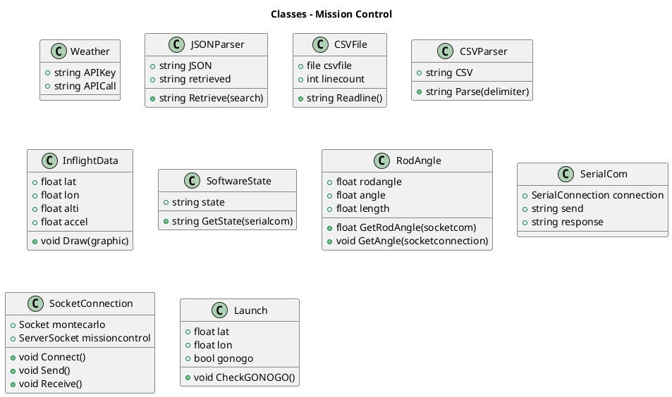

# ENGR 301: Project Requirements Document

The aim of this document is to specify the requirements of the system your group is to build. The focus of a requirements document is the problem you are attempting to solve:  not a first attempt at a solution to that problem. This document should communicate clearly to the supervisor, client and course coordinator what the system you build is going to do, and what constraints it must meet while doing so.

The document should also demonstrate your understanding of the main analysis principles and quality guidelines, and applicable standards, using tools and notations as necessary to communicate the requirements precisely, unambiguously and clearly in a written technical document. Page specifications below are *limits not targets* and refer to the pages in the PDF generated from the markdown. Because the size of your document is necessarily limited, you should ensure that you focus your efforts on those requirements that are most important to completing a successful system: if sections are at their page limit, indicate how many items would be expected in a complete specification. 

The ENGR 301 project proposal and requirements document should be based on the standard ISO/IEC/IEEE 29148:2011(E), primarily sections 8.4 and 9.5, plus section 9.4 for projects involving hardware and ISO 25010 SQuaRE for systemic requirements. While excerpts from the standard have been quoted within the template, to understand what is required it will be necessary to read earlier sections of the standards themselves. A supplementary treatment of requirements gathering in engineering projects may be found in [Requirements in Engineering Projects](https://victoria.rl.talis.com/items/F166DA94-DAD8-FBDB-0785-7A63C9BA3603.html?referrer=%2Flists%2F5886F297-2506-1F17-45D9-7F04CEE284EE.html%23item-F166DA94-DAD8-FBDB-0785-7A63C9BA3603) (Talis). The requirements document should contain the sections listed below, and conform to the formatting rules listed at the end of this brief. 

All team members are expected to contribute equally to the document and list their contributions in section 6 of the document. You should work on your document in your team's GitLab repository. While collective contributions are expected to be the exception rather than the rule, if more than one team member has contributed to a particular commit then all those team member IDs should be included in the first line of the git commit message. `git blame`, `git diff`, file histories, etc. will be tools used to assess individual contributions, so everyone is encouraged to contribute individually, commit early and commit often. Any team wishing to separate individually contributed sections into a single file before collation into the single proposal document for submission is welcome to do so.

---

# ENGR 301 Project *Mission Control Group 7* Project Proposal and Requirements Document
#### Bryan Lim, Kaustubh Pawar, Isaac Read, Mohammad Shaik, Daniel Vidal Soroa, James West

## 1. Introduction

### Client

The client is Andre Geldenhuis, he can be contacted through Mattermost at @geldena.

### 1.1 Purpose

This document describes the functional and non-functional requirements for the Rocket Mission Control which will allow users to launch, monitor, and adjust rocket systems before, during, and after flight. 

### 1.2 Scope

Rocket Mission Control is a standalone program which will allow users to get information from a rocket, safely launch the rocket, monitor the rocket data during flight, and allow small adjusts during flight. The system will integrate with rocket hardware and retrieve weather data to assist with the flight. The goal of the project is to build a safe mission control software that can improve the launch and flight of rockets.

### 1.3 Product overview 
#### 1.3.1 Product perspective

This software is intended to assist the mission control of hobby rockets. It should have the functionality to interact with Monte Carlo Simulation software to assist the launching configuration and predict possible landing areas of a hobby rocket. 

The requirement necessary to use this software as a mission control is a ground station that can transfer rocket data via USB in Comma Separated Values (CSV) with the following format: ACC, ALT, LAT, LONG; representing the vertical acceleration, altitude, latitude and longitude of a rocket during flight.

The requirement to interact with Monte Carlo simulation software is that this can establish a client-server communication using a socket as an endpoint between the machines. This way the program will use a localhost-port to interact with the Monte Carlo Simulation Software so they both need to run on the same computer.

> A block diagram showing the major elements of the larger system, interconnections, and external interfaces can be helpful.

Within the following constraints the software will operate as follows:

a)	System interfaces:

1.  Serial communication with the ground station. 
2.	Socket communication with MCS software.

b)	User interfaces: Window layout, no specific screen requirements, simple and intuitive, the user has to see all the required information and functionality at first sight, no menus or programmable function keys.

c)	Hardware interfaces: Serial communication through USB port with the ground station. The required configuration characteristics are USB port (COM1, COM2, etc.) and the transmission velocity (9600 bits/sec default).

d)	Software interfaces: Client-server connection with the MCS program via socket. The required configuration characteristics are IP (localhost) and port.  

e)	Communications interfaces: No local network communication unless with the MCS (running in the same computer).    

f)	Memory: No specific memory requirement, this software is not expected to use large memory resources.  

g)	Operations: This software is expected to work under only one mode of operation. The user must use the launching position and wind profile to estimate possible landing locations through the MCS software and give the go/no go function. Once the rocket is launched the Mission Control will log and display in-flight rocket data like vertical acceleration, altitude and GPS coordinates. 

h)	Site adaptation requirements: Not specific site adaption requirements. It will be convenient to run the software on a laptop with enough autonomy to access the remote sites necessaries for rocket launching.

#### 1.3.2 Product functions

The principal aim of this product is to display data from an in-flight rocket to be analyzed by the user. This data will be displayed using a line chart to show the vertical acceleration and the altitude of the rocket. Meanwhile, information related to the GPS location of the rocket will be presented in text boxes to facilitate rocket recovery after landing. Finally, this data will be analyzed to decide the state of the rocket (Pre-Launch, Launch Detect, In-flight, Landed). 

Another important function of the mission control software is to provide the go/no-go signal to the rocket. This message should allow the rocket to arm the parachute charge and attends to security purposes. The go/no-go function will be sent by the mission control team once the rocket is ready to be launched and there are any persons close to the launching site.

To assist the launching decision, one of the functionalities of this project is to establish communication between the mission control and Monte Carlo Simulation software. This will permit the user to assess possible landing areas according to wind conditions and launching rod configuration. As an additional feature, the software could use this communication to suggest an upwind trajectory to minimize the landing area.

Finally, the software should be capable of using wind profiles to assist in the launching analysis. In principle, this data will be downloaded beforehand from Open Weather Servers and used to run simulations onsite. The backup plan will be typing these values manually so the software should also allow this functionality.

#### 1.3.3 User characteristics   

This software is intended for assisting hobby rockets launching and flight. Rockets use black powder or other combustibles in their engines and explosives charges to launch the parachute when falling. Due to the functionality of this software to send the signal to activate the parachute charge, it is expected its users to be adults and responsible persons with a full understanding of this activity and the risks inherent to it.      

#### 1.3.4 Limitations

As a part of a larger system, the principal limitations of this software will be the capacity of the other systems to interact with it. In this case, the ground station needs to be capable to provide the rocket data through the USB port using standard baud rate speeds like 1200, 2400, 4800, 19200, 38400, 57600, and 115200. This data needs to be in CSV format and respecting the order specified (ACC, ALT, LAT, LONG). The possibility of selecting in which order the values are going to be received or substituting or adding new variables are limitations of tis software.

With respect to the MCS software, this program must permit socket communication with Mission Control running in the same computer. Besides it must implement the functionalities requested by the costumer: simulate possible landing areas using launching location and wind profiles and suggest upwind trajectories to minimize the landing distance. Socket communication between two programs running in different computers is a limitation of this software.

For safety and security consideration this software is limited to adult and responsible persons with full understanding of hobby rocketry and the risks inherent to it. 

## 2. References

References to other documents or standards. Follow the IEEE Citation  Reference scheme, available from the [IEEE website](https://www.ieee.org/) (please use the search box). (1 page, longer if required)

## 3. Specific requirements  

### 3.1 External interfaces

a)  Laptop : A basic laptop with windows operating system which will displays the simulations on its screen and also it should be equipped with USB ports which will be used to communicated with the ground station.

b)  USB to Serial adapter : This cable helps us to convert the USB data into a data which can be read by serial-enabled devices. This is vital in serial communication with ground station.

### 3.2 Functions

This is typically the longest subsection in the document. List up to fifty use cases (in order of priority for development), and for at least top ten focal use cases, write a short goal statement and use case body (up to seven pages).  Identify the use cases that comprise a minimum viable product.

The following use cases are required for the Minimum Viable Product:

| **USE CASE 1**            | **Display In-Flight Rocket Data**                                                                                           |
|---------------------------|---------------------------------------------------------------------------------------------------------------|
| **Goal**                  | Display in-flight rocket data to laptop in field Data includes Latitude, Longitude, Altitude, Acceleration |
| **Preconditions**         | Rocket has been launched    Mission control software is running and ready to receive data     Rocket and Mission control are sucsessfully connected                                       |
| **Success End Condition** | In-flight data is displayed and updated in real time. Is easily comprehensable by the user                    |
| **Failed End Condition**  | In-flight data is displayed inncorrrectly or not at all Data is hard to read.                                |
| **Actors**                | Mission controller                                                                                             |
| **Trigger**               | Rocket is launched                                                                                            |
| **STEPS**                 | **ACTION**                                                                                                        |
|                    **1.** | Laptop receives Comma Seperated Values file from rocket at a regularly defined interval                       |
|                    **2.** | Mission control software updates appropiately displayed graphs and text boxes with provided data              |
|                    **3.** | Repeats steps 1 and 2 until Rocket has landed                                                                 |
| **EXTENSIONS**            |                                                                                                               |
|                   **1a.** | Receive faulty or missing data           **1a1.** Display warning message, log error                       |

 
 

| **USE CASE 2**            | **Display Current Software State of Rocket**                                                                                           |
|---------------------------|---------------------------------------------------------------------------------------------------------------|
| **Goal**                  | Display Current Software State of rocket data to laptop in field Rocket states include Pre-Launch, Launch Detect, In-flight, Landed|
| **Preconditions**         | Rocket has been turned on and is paired with mission control laptop  Mission control software is running and ready to receive data                                        |
| **Success End Condition** | Software State is displayed and updated in real time. Is easily comprehensable by the user                    |
| **Failed End Condition**  | Software State is displayed inncorrrectly or not at all.  State is hard to read.                                |
| **Actors**                | Mission controller                                                                                             |
| **Trigger**               | Rocket electronics are turned on                                                                                            |
| **STEPS**                 | **ACTION**                                                                                                        |
|                    **1.** | Laptop receives State data from rocket at a regularly defined interval   |
|                    **2.** | Mission control software updates appropiate text boxes with provided State data                    |
|                    **3.** | Repeats steps 1 and 2 until Rocket is turned off        |
| **EXTENSIONS**            |                                                                                                               |
|                   **1a.** | Receive faulty or missing data           **1a1.** Display warning message, log error                       |
 
 

| **USE CASE 3**            | **Tell the Rocket When Launch Is imminent**                                                                                           |
|---------------------------|---------------------------------------------------------------------------------------------------------------|
| **Goal**                  | Send data to the rocket that indicates launch is imminent This is so the Rocket can change state from Pre-launch to Launch Detect and can arm the parachute ejection charges|
| **Preconditions**         | Rocket has been turned on and is paired with mission control laptop  Mission control software is running and ready to receive data                                        |
| **Success End Condition** | Rocket recieves and acknowleges message that launch is imminent                  |
| **Failed End Condition**  | Rocket recieves no message or corrupted message Rocket recieve message when unintended                                |
| **Actors**                | Mission controller                                                                                             |
| **Trigger**               | Mission controller decides launch is imminent                                                                                          |
| **STEPS**                 | **ACTION**                                                                                                        |
|                    **1.** | Mission controller presses button on mission control software indicating launch is imminent   |
|                    **2.** | Mission control software sends launch imminent message to Rocket                   |
|                    **3.** | Mission control software receives acknowlegment message from rocket        |
|                    **4.** | Display launch imminent Software State (use case 2)        |
| **EXTENSIONS**            |                                                                                                               |
|                   **3a.** | Mission control software does not receive acknowlegment message from rocket           **1a1.** Display warning message, log error   **1a2** Attempt to send message launch imminent message again   **1a3**    If still no acknowlegment - End of use case, fail      |
 
 

| **USE CASE 4**            | **Decide if Launch is GO or NO GO**                                                                                           |
|---------------------------|---------------------------------------------------------------------------------------------------------------|
| **Goal**                  | Decide if launch is GO/NO Go and send appropriate message to rocket|
| **Preconditions**         | Rocket has been turned on and is paired with mission control laptop  Mission control software is running and ready to receive data    Software state is Launch Detect                                      |
| **Success End Condition** | Make appropriate decision based on predicted landing locations and send decision to rocket                 |
| **Failed End Condition**  | Rocket recieves no message or corrupted message Rocket recieve innaproprate message (GO when it should be NO GO)                               |
| **Actors**                | Mission controller                                                                                             |
| **Trigger**               | Mission controller decides to check launch conditions                                                                                         |
| **STEPS**                 | **ACTION**                                                                                                        |
|                    **1.** | Mission controller presses button on mission control software indicating to check launch conditions   |
|                    **2.** | Mission control software gets current weather conditions                   |
|                    **3.** | Mission control software sends weather conditions to simulation        |
|                    **4.** | Mission control software receives probable landing areas       |
|                    **5.** | Mission control software checks these probable landing areas are within the accepted landing zone       |
|                    **6.** | Mission control software sends GO message to rocket if they are within the accepted zone, else sends NO GO        |
|                    **7.** | Mission control software recieves GO/NO acknowlegment from rocket       |
|                    **8.** | Mission control software displays appropriate Software State (use case 2)      |
| **EXTENSIONS**            |                                                                                                               |
|                   **7a.** | Mission control software does not receive acknowlegment message from rocket           **7a1.** Display warning message, log error   **7a2** Attempt to send message launch imminent message again   **7a3**    If still no acknowlegment - End of use case, fail      |

 
 

The following use cases are in excess of the MVP

| **USE CASE 5**            | **Suggest launch rod angle**                                                                                           |
|---------------------------|---------------------------------------------------------------------------------------------------------------|
| **Goal**                  | Suggest a launch rod angle to keep probable landing areas within acceptable landing zone   **OPTIONAL:** Launch rod angle shoud minimise distance from launch site by calculating up wind trajectory|
| **Preconditions**         | Rocket has been turned on and is paired with mission control laptop  Mission control software is running and ready to receive data    Rocket has not been launched and has recieved a NO GO message                                    |
| **Success End Condition** | Make appropriate rod angle change based on predicted landing locations and display rod angle change on laptop screen  Running Use Case 4 after changing rod angle results in GO result               |
| **Failed End Condition**  | Suggested rod angle does not result in a GO message (use case 4)                               |
| **Actors**                | Mission controller                                                                                             |
| **Trigger**               | Use case 4 results in NO GO                                                                                        |
| **STEPS**                 | **ACTION**                                                                                                        |
|                    **1.** |  //needs simulation team?? not sure about this one  |
 
 

| **USE CASE 6**            | **Save and Export Completed Flight Data as CSV**                                                                                           |
|---------------------------|---------------------------------------------------------------------------------------------------------------|
| **Goal**                  | Save the completed flight data after the rocket has landed as a single CSV file aswell, ready for export |
| **Preconditions**         | Rocket has completed its flight and landed                                    |
| **Success End Condition** | Single CSV file has been created and saved on the laptop being used ofr mission control   CSV contains all flight data in order of occurrence             |
| **Failed End Condition**  | CSV file is incomplete or contains wrong data                              |
| **Actors**                |                                                                                             |
| **Trigger**               | Rocket lands, indicated by altitude being bellow threshold and acceleration data reading zero for a set amount of time                                                                                         |
| **STEPS**                 | **ACTION**                                                                                                        |
|                    **1.** | Itterate over rocket data which is stored in memory and write it to a file using Java IO  |

 
 

| **USE CASE 7**            | **Save and Export Completed Flight Data as Graph images**                                                                                           |
|---------------------------|---------------------------------------------------------------------------------------------------------------|
| **Goal**                  | Export image of graphs   **Optional** Export google map with rocket tracjectory overlayed |
| **Preconditions**         | Rocket has completed its flight and landed                                    |
| **Success End Condition** | Image of completed garphs is saved on the laptop being used for mission control           |
| **Failed End Condition**  | Image of graphs is incomplete or contains wrong data                              |
| **Actors**                |                                                                                             |
| **Trigger**               | Rocket lands, indicated by altitude being bellow threshold and acceleration data reading zero for a set amount of time                                                                                         |
| **STEPS**                 | **ACTION**                                                                                                        |
|                    **1.** |   |

### 3.3 Usability Requirements

The main goal is to create a system interface which should be easy to operate or integrate with other systems, with the characteristics of high efficiency and user satisfaction.

##### 1) Application Set-up

•       The user should be able to install and run the software on any platform. ( how are we going to achieve it)

•	    Application interface should be user friendly where operating person feels convenient in learning and exploiting the services provided by the system. User must be able to determine the flight status of the rocket such as its location and altitude upon presentation. User could easily recognise the weather conditions from the interface. User can be able to easily interpret the data received from monte carlo simulation. User should be able to suggest the change in rod angle from looking at the interface.

•	    The appropriate user must be able to recognize when the parachute should be commended to open if in case the need arises.

•	    Application must be able to log data so that the user can access it to analyse in future.

•	    Application must represent the flight path in a readable manner.

•	    As the software being open source, appropriate user could be able to make required changes and customize accordingly. 

##### 2) Application Integration

•	    Should implement less complex interface to integrate with other systems

•	    Should maintain continuous communication pre-flight and during flight situations.

•	    Go / No Go functionality should be relayed such that it can assist the launch appropriately. Application must be able to communicate with monte carlo simulation prior to launch and display the probable landing location.

##### 3) Performance / Efficiency of use

•	    User could be able to use the application without continuous data connection

•	    The input sensor data from rocket must be recorded error free and displayed without any error and delay.

•	    If forecasted data is being used, Current weather conditions should be displayed without any mismatch.

•	    The mission control could suggest changing the launch rod angle into the wind to ensure the rocket remains in bounds.

•	    Go / No Go functionality should be implemented without any ambiguity which may cause misinterpretation during launch event.

### 3.4 Performance requirements

The static and the dynamic numerical requirements placed on the software or on human interaction will be as follows. 

Static numerical requirements may include the following:

1. Terminals to be supported: 1
2. Number of simultaneous users to be supported: 1
3. Amount and type of information to be handled: The information to be handled will be in-flight rocket data, weather parameters and possible landing locations. The amount of rocket data will be equivalent to the length of the fly.

The dynamic numerical requirements includes the amount of data to be processed within one second. In this case all data received within one second should be displayed, as the user needs to track the parameters of the rocket in real time.

### 3.5 Logical database requirements

See 9.5.14. for most systems, a focus on d) and e) is appropriate, such as an object-oriented domain analysis. You should provide an overview domain model (e.g.  a UML class diagram of approximately ten classes) and write a brief description of the responsibilities of each class in the model (3 pages).

Work in progress as the project continues

### 3.6 Design constraints

see 9.5.15 and 9.5.16. for most systems, this will be around one page.

> 9.5.15 Design constraints 
> Specify constraints on the system design imposed by external standards, regulatory requirements, or project limitations.
> 
> 9.5.16 Standards compliance 
> Specify the requirements derived from existing standards or regulations, including:
> 
> a) Report format; 
> b) Data naming; 
> c) Accounting procedures; 
> d) Audit tracing.
> 
> For example, this could specify the requirement for software to trace processing activity. Such traces are needed for some applications to meet minimum regulatory or financial standards. An audit trace requirement may, for example, state that all changes to a payroll database shall be recorded in a trace file with before and after values.

### 3.7 Nonfunctional system attributes

Present the systemic (aka nonfunctional) requirements of the product (see ISO/IEC 25010).
List up to twenty systemic requirements / attributes.
Write a short natural language description of the top nonfunctional requirements (approx. five pages).

### 3.8 Supporting information

see 9.5.19. 

## 4. Verification

3 pages outlining how you will verify that the product meets the most important specific requirements. The format of this section should parallel section 3 of your document (see 9.5.18). Wherever possible (especially systemic requirements) you should indicate testable acceptance criteria.

In the production of mission control software, there is a total of 5 use cases which are: 
1. Display In-Flight Rocket Data
2. Display Current Software State of Rocket
3. Tell the Rocket When Launch Is imminent
4. Decide if Launch is GO or NO GO
5. Suggest launch rod angle
6. Save and Export Completed Flight Data as CSV
7. Save and Export Completed Flight Data as Graph images

It is important to ensure the workability of each use cases to achieve the minimum viable product of the mission control software. A series of isolated tests will be carried out on each use cases individually. After isolated tests have been carried out and each use cases are up to standard, a combined test of the entire rocket launch sequence will be carried out.

### 4.1 Display In-Flight Rocket Data

To ensure that the software is able to recieve data from the rocket even when rocket is far away from laptop in field, the following test will be carried out:

**1.** Seperate laptop will be passing .csv file every 0.5 seconds for up to 30 seconds to the arduino module that would pass it to the main laptop.

**2.** Main laptop will be checked that a .csv file is recieved every 0.5 seconds until sending has stopped.

**3.** Latitude, Longitude, Altitude, Acceleration Graphs must show up on Graphical User Interface.

**4.** When each .csv file is recieved on main laptop, graphs will be checked that they are updated every time .csv file is recieved.

### 4.2 Display Current Software State of Rocket

To ensure that current software state of rocket is recieved and displayed in real time the following test will be carried out:

**1.** Seperate laptop will be passing serial file that shows the software state of rocket every 0.5 seconds for up to 30 seconds to the arduino module that would pass it to the main laptop.

**2.** Main laptop will be checked that a serial file is recieved every 0.5 seconds until sending has stopped.

**3.** Software state box must show up on Graphical User Interface.

**4.** When each serial file is recieved on main laptop, software state will be checked that it is updated every time serial file is recieved.

### 4.3 Tell the Rocket When Launch Is imminent

To ensure that mission control software can indicate to rocket that launch in imminent the following test will be carried out:

**1.** Main Laptop will send data to seperate laptop.

**2.** Seperate laptop must recieve the data and prints "imminent launch" on the console.

### 4.4 Decide if Launch is GO or NO GO

To ensure that mission control software can communicate successfully with simulation the following test will be carried out:

**1.** Main laptop will retrieve 1 weather data before launch and store it in a serial file. Serial file must contain **Wind Speed** and **GPS coordinates**.

**2.** Main laptop will send serial file to simulation laptop. Simulation laptop must be able to open the serial file to access contents.

**3.** Simulation laptop will send probable landing areas in a serial file to main laptop. Main laptop must be able to open the file to access the contents.

**4.** Main laptop needs to be able to read the contents sent by simulation laptop and run an algorthim to see if probable landing area is wthin acceptable range. 3 probable landing area serial file will be sent by simulated laptop.
 
  file 1 : Probable landing area all within landing zone
  file 2.__ : Probable landing area all outside landing zone which will be split between 1st,2nd,3rd,4th quadrant
         2.1: Probable Landing zone in 1st quadrant
         2.2: Probable Landing zone in 2nd quadrant
         2.3: Probable Landing zone in 3rd quadrant
         2.4: Probable Landing zone in 4th quadrant
  file 3 : Probable landing area half within landing zone

**5.** Graphical User interface must show the GO/NOGO correctly for each file mentioned above
 
         file 1 : Go
         file 2.1 : No Go (in 1st Quadrant)
         file 2.2 : No Go (in 2nt Quadrant)
         file 2.3 : No Go (in 3rd Quadrant)
         file 2.4 : No Go (in 4th Quadrant)
         file 3 : No Go

**6.** Main laptop will send command from **5** to rocket laptop.

**7** Rocket laptop must recieve command successfully and display command on console. Rocket laptop must send acknowlegment to Main laptop.

**8** Software state must be update on Main laptop graphical user interface.

### 4.5 Suggest launch rod angle
To successfully sugest new rod angle such that rocket landing will be within boundaries:

**1.** Repeating section 4.1.4 and Continuing from section 4.1.4 step 4, simulation laptop will send file 2.X to main laptop.

**2.** Main laptop must recieve the file and user interface must show command "No Go". 

**3.** Main laptop must analyse probable landing zone and show "landing zone exceeds in X quadrant".

**4.** Main laptop must send new "rod angle" value of (current angle + 10 deg) to simulation laptop.

**5.** Simulation laptop to send new probable landing zone files to main laptop.
 
  file 1 : Probable landing area all within landing zone
 file 2.Y : Probable landing area all outside landing zone which will be split between 1st,2nd,3rd,4th quadrant
         file 2.1 : No Go (in 1st Quadrant)
         file 2.2 : No Go (in 2nd Quadrant)
         file 2.3 : No Go (in 3rd Quadrant)
         file 2.4 : No Go (in 4th Quadrant)

**6.** Repeat test from step 1 with simulation laptop sending file 2.Y if Y=(1,2,3,4).
  Update graphical user interface with "GO" command if file 1 is recieved from simulation laptop.

**7.** Send to rocket laptop "GO".

### 4.6 Save and Export Completed Flight Data as CSV
To successfully save flight data in CSV format when rocket have landed.

**1.** Rocket Laptop will send 10.csv file with the last 8 having accleration of less than 0.3m/s2 to main laptop. 

**2.** Main laptop must recieve the file and update software state to "Landed" when 8 consecutive .csv files shows acceleration 0.

**3.** Main laptop must save and export all the .csv files automatically in a folder.

### 4.7 Save and Export Completed Flight Data as Graph images

To successfully save and export complete graph images for rocket launch

**1.** Rocket Laptop will send 10.csv file with the last 8 having accleration of 0.3m/s2 to main laptop. 

**2.** Main laptop must recieve the file and update software state to "Landed" when 8 consecutive .csv files shows acceleration 0.

**3.** Main laptop must save and export all the graph images automatically in a folder.

## 5. Development schedule.

The conditions accorded to release a minimum viable product are to satisfy the most relevant user stories/features. The most significant user stories by its priority order are:
1.	Read serial Data in CSV format and populate line chart and text boxes (Activity).
* [ ] Connect to ground station (Task)
* [ ] Read and manipulate serial Data (Task).
* [ ] Populate Line chart (Task).
* [ ] Populate text box (Task).
* [ ] Update rocket state (Task).

2.	Read weather data from the web site and populate the text boxes (Activity).
* [ ] Connect to Open Weather web site (Task).
* [ ] Request weather data according GPS location (Task).
* [ ] Populate text boxes (Task).

3.	Request to MCS minimum landing area (Activity).
* [ ] Connect to MCS (Task).
* [ ] Request landing area to MCS (Task).
* [ ] Populate text boxes (Task).

4.	 Send go signal (Activity).
* [ ]  Send go signal to ground station (Task).

### 5.1 Schedule

According these user stories, the development schedule will be structured as follow:
* Week 8 preparing for sprint planning meeting
* Week 9 (Sprint 1)
  * (25/05/20) sprint 1 planning meeting:
  *	Goal: Satisfy user story 1.
  *	Time: Weeks 9-10
* Week 11 (Sprint 2)
  * (08/06/20): Test acceptance criteria for user story 1.
  * (09/06/20): Sprint 2 planning meeting:
  * Goal: Satisfy user story 2.
  * Time: Weeks 11-12.
* Week 1 (Sprint 3)
  * (First meeting): Test acceptance criteria for user story 2.
  * (Next meeting): Sprint 3 planning meeting:
  * Goal: Satisfy user story 3.
  * Time: Weeks 1-2.
* Week 3 (Sprint 4) 
  * (First meeting): Test acceptance criteria for user story 3.
  * (Next meeting): Sprint 4 planning meeting:
  * Goal: Satisfy user story 4.
  * Time: Weeks 3-4.
* Week 5: Test acceptance criteria for user story 4 and minimum viable product.
* Week 6-7 – Sprint 5.
* Week 8-9 – Sprint 6…

1. architectural prototype

2. Minimum viable product will be release during week 5 of the second trimester when the product satisfies the four most relevant features (prioritized user stories). 

3. Further releases and extra feature will be accorded and assigned after week 5 and developed during the next sprints.

### 5.2 Budget

Present a budget for the project (table), and justify each budget item (one paragraph per item, one page overall). 

### 5.3 Risks 

1. Risk: Since, this software is been created individually as a team, it might create problems for developer in estimating scheduling development time. 
   Risk type: Schedule risk. 
   Likelihood: 3/5  
   Impact: 5/5  
   Mitigation: All members will be attending weekly group meetings to discuss and at the same monitor on each others works. 

2. Risk: Improper process implementation, ambiguity in individual responsibilities and unstructured prorities could be a potential risk for project. 
   Risk type: Strategic risk. 
   Likelihood: 3/5  
   Impact: 5/5  
   Mitigation: With the help of gitlab all members could create issues and assign themselves to it. This will help them to track and prioritize individual responsibilities. 

3. Risk: Unforeseen circumstances like technology obsolesence, changes in government policies, pandemics may intensify the risk factor involved in project development.  
   Risk type: External Risk. 
   Likelihood: 3/5  
   Impact: 5/5  
   Mitigation: By virtue of assumption analysis and proper strategic planning a team can minimize the risk from such unforeseen circumstances. 

4. Risk: Since, software developers rely on their hands to practice their craft, injuries such as carpal tunnel, shoulder strain etc. are somethings to be considered as it may lead to a potential health and safety risk.  
   Risk type: Health and safety. 
   Likelihood: 2/5  
   Impact: 5/5  
   Mitigation: A proper work plan and a little bit of excercising may help mitigate this risk. 

SCHEDULING RISK
Description: considering the abstract nature and uniqueness of the program, Software development is inherently difficult to estimate and plan, Projections of the tasks are either optimistic or based on a template. Project managers may find it challenging to estimate the time, scope and resources required to complete the project. This will lead to unrealistic schedule, budget, ambiguous scope and inadequate resources, which are known to be the major causes of project failure. 
Type: Planning; Likelihood: 0.65; Impact: 10
Mitigation strategies: Get the team involved more in the preparation and estimation. Get early reviews and escalate the issues directly with stakeholders. The team 's true momentum easily emerges by operating in small increments. Timely review and schedule adjustments will help to mitigate this risk.

REQUIREMENTS RISK
Description: Issues may arise when system requirements are not been identified appropriately. More and more features which were not identified in the initial stages will come to light once the projects set ahead. These requirements may pose a threat to estimates and schedules.   Unclear, imprecise and nonsensical specifications can result in inconsistency.
Type:  Requirements Management; Likelihood: 0.75; Impact: 10
Mitigation strategies: In the initial phases of application description, team discussions should be held with the end user. Maintaining a close connection with the user community throughout the life cycle of system engineering will help mitigate this risk. Routine trade-off discussions on functionality and requirements should take place at every boundary of iteration.

SPECIFICATIONS RISK
Description: It becomes obvious as coding and integration starts that the specification is incomplete, or includes not understandable requirements. Lack of understanding and coordination between different project groups may result in a breakdown in overall project integration.
Type:  Planning & Execution; Likelihood: 0.50; Impact: 8
Mitigation strategies: Dedicated members should be allocated to have frequent discussions with other teams from the beginning to understand each other's requirements. In our case, contact should be made with the Monte carlo simulation team and the avionics team so that specifications can be communicated and implemented without fail. Making assumptions and working should be minimized.

PRODUCTIVITY RISK
Description: The sense of urgency to work in earnest is often absent due to long project timelines resulting in time lost in initial stages of a project which can never be recovered. It is possible to underestimate the time between initiation and actual deployment of code in the main code branch which can establish high likelihood of delayed delivery.
Type:  Planning & Execution; Likelihood: 0.50; Impact: 9
Mitigation strategies: Time can be bounded by having short iterations which give a sense of urgency. In addition, the percentage of project risk can be substantially reduced by practicing effective communication with the teams, creating a solid organizational structure and implementing elaborate planning.

COMMUNICATION AND INFORMATION FLOW RISK
Description:  Regarding team communication, we often see varying views among members of the team on the open issues and what the goals are, indicating a lack of clear and timely communication, and sometimes some conflict among members. More often however, it is insufficient or ignored communication with clients and management. Usually the issue is with infrequent updates or lack of full disclosure of the released information.
Type:  organizational Management; Likelihood: 0.90; Impact: 7
Mitigation strategies: Team building activities should be carried out frequently to enhance the cooperation between members. Sessions on knowledge sharing and peer reviews should be done as a regular activity.

APPLICATION AND SYSTEM ARCHITECTURE RISK
Description: Taking the wrong path can have catastrophic consequences for a platform or architecture. When a wrong choice has been made then the implementation of the program will not be successfully completed and integration issues can occur later. Furthermore, architectural design method choice can affect programming language choice. If this has not been considered, then developers may choose a language that does not support the method of architectural design used.
Type:  Technical; Likelihood: 0.60; Impact: 9
Mitigation strategies: It is important, as with the technical risks, that the team should include experts who understand the architecture and are able to make sound design choices. All the individual participants must make an effort to learn the technical aspects expected of the project. Simulation and modelling in bits may help avoid failure.

REQUIREMENT DOCUMENT RISK
Description: If developers were not involved in the analysis of requirements and the process of interpretation, then they could not understand the requirements document. Therefore, they would not be able to start their design on a solid knowledge of the system requirements, and therefore can create a design for a system other than the intended one.
Type:  Documentation; Likelihood: 0.60; Impact: 6
Mitigation strategies: All the team members including the developers should be involved during documentation stage. It should not be done by particular individuals.

#### 5.4.1 Safety Plans

Safety Plans may be required for some projects, depending on project requirements. Safety Plan templates are available on the course Health & Safety page. Two questions all teams must answer are:

**Do project requirements involve anything that can cause serious harm or death?**  
Examples: building/modifying devices using voltages > 60 V, chemicals, large moving machinery, flying devices, bodies of water.

If so, you will have to write a separate Safety Plan as part of project requirements, and the Safety Plan must be referenced in this section. For health and safety risks involving serious harm or death, you must first contact the School Safety Officer and Course Coordinator first to discuss the Safety Plan and project requirements.

**Do project requirements involve anything that can cause harm or injury?**  
Examples: building/modifying things with voltages <= 60V, small moving machinery, wearable devices.

If so, you will have to write a separate Safety Plan as part of project requirements, and the Safety Plan must be referenced in this section. For health and safety risks involving harm or injury, you should write a draft of the Safety Plan before contacting the School Safety Officer and Course Coordinator to discuss the Safety Plan and project requirements.

If a safety plan is required, list in this section the date the School Safety officer accepted your Health and Safety plan (if accepted by submission date).

_If the project is purely software and requires no contact risks involving physical harm, then state "Project requirements do not involve risk of death, serious harm, harm or injury." in this section._

## 6. Appendices
### 6.1 Assumptions and dependencies 

One page on assumptions and dependencies (9.5.7).

### 6.2 Acronyms and abbreviations

MCS: Monte Carlo Simulation software.

## 7. Contributions

A one page statement of contributions, including a list of each member of the group and what they contributed to this document.

Bryan - Done Section 4 (Verification)
Isaac - Done Section 3.2 Use cases
---

## Formatting Rules 

 * Write your document using [Markdown](https://gitlab.ecs.vuw.ac.nz/help/user/markdown#gitlab-flavored-markdown-gfm) and ensure you commit your work to your team's GitLab repository.
 * Major sections should be separated by a horizontal rule.

## Assessment  

The goal of a requirements document is the problem you are attempting to solve:  not a first attempt at a solution to that problem. The most important factor in the assessmernt of the document is how will it meet that goal. The document will be assessed for both presentation and content. 

The presentation will be based on how easy it is to read, correct spelling, grammar, punctuation, clear diagrams, and so on.

The content will be assessed according to its clarity, consistency, relevance, critical engagement and a demonstrated understanding of the material in the course. We look for evidence these traits are represented and assess the level of performance against these traits. While being comprehensive and easy to understand, this document must be reasonably concise too. You will be affected negatively by writing a report with too many pages (far more than what has been suggested for each section above).

We aim to evaluate ENGR301 documents and projects as if they were real projects rather than academic exercises &mdash; especially as they are real projects with real clients. The best way to get a good mark in a document is to do the right thing for your project, your client, and your team. We encourage you to raise questions with your tutor or course staff, as soon as possible, so you can incorporate their feedback into your work.

---
